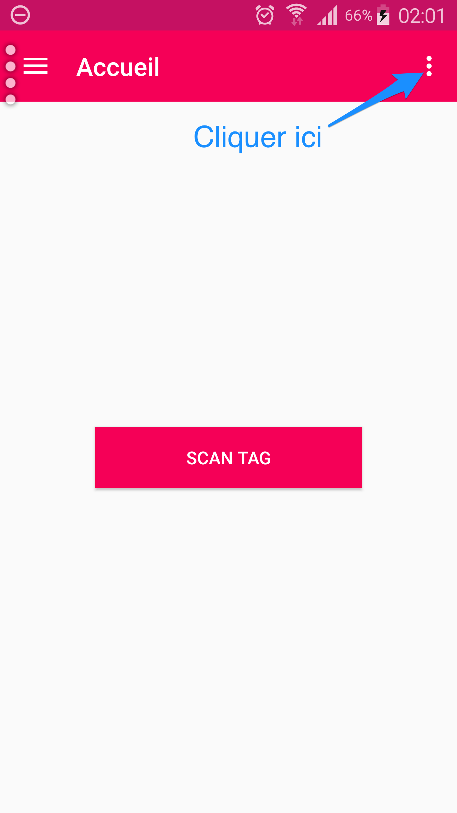
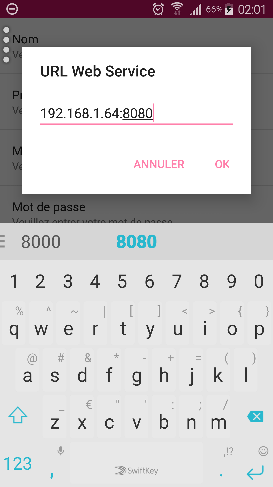
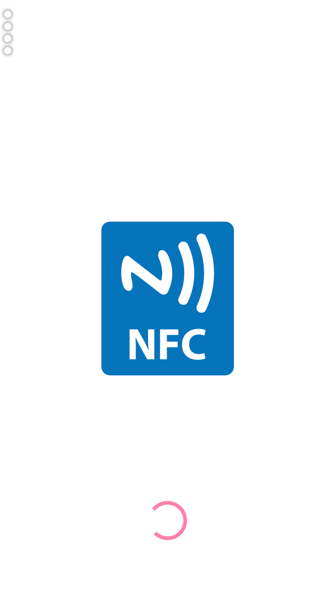
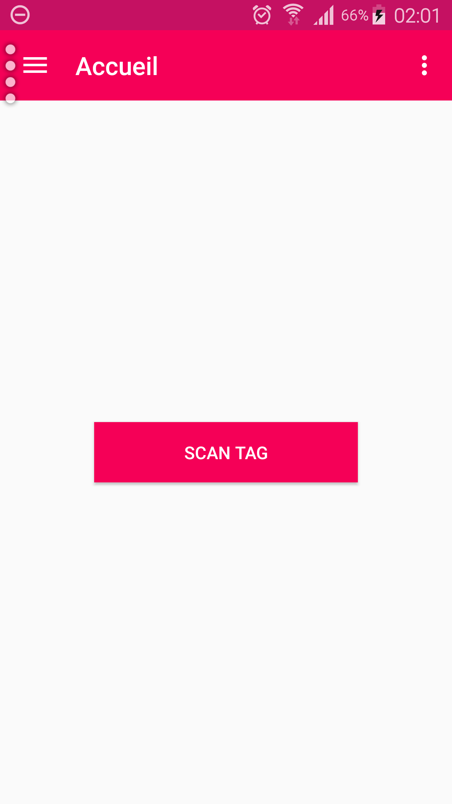
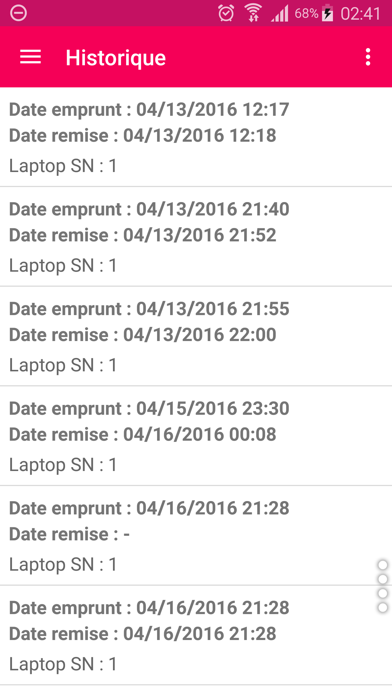
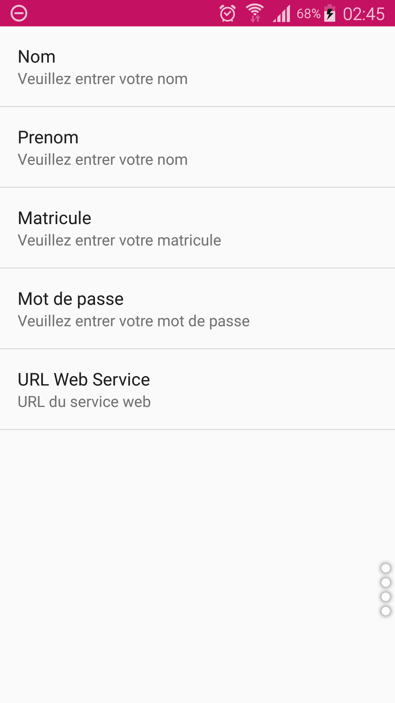
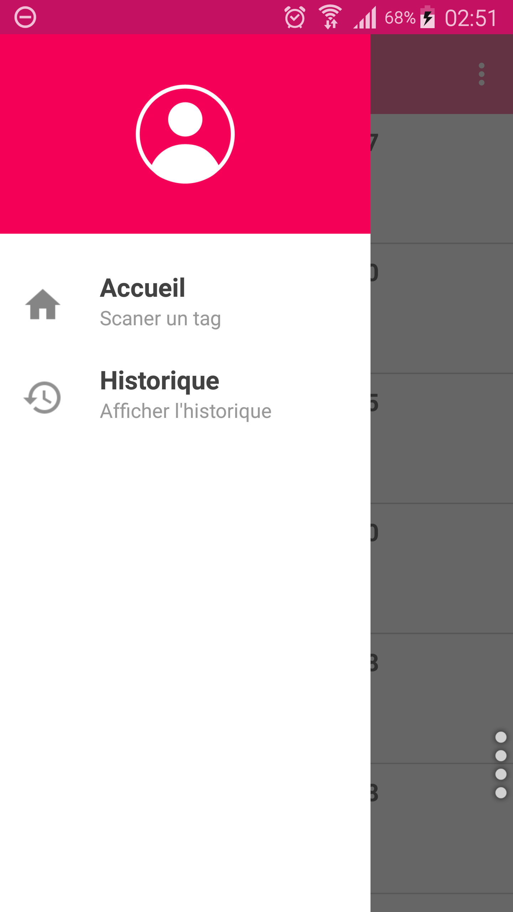
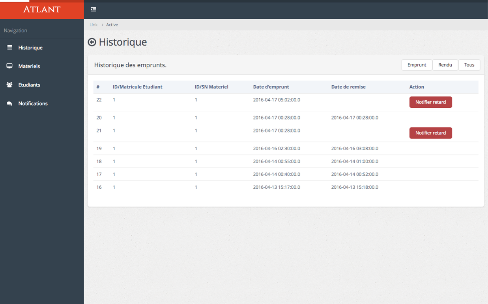
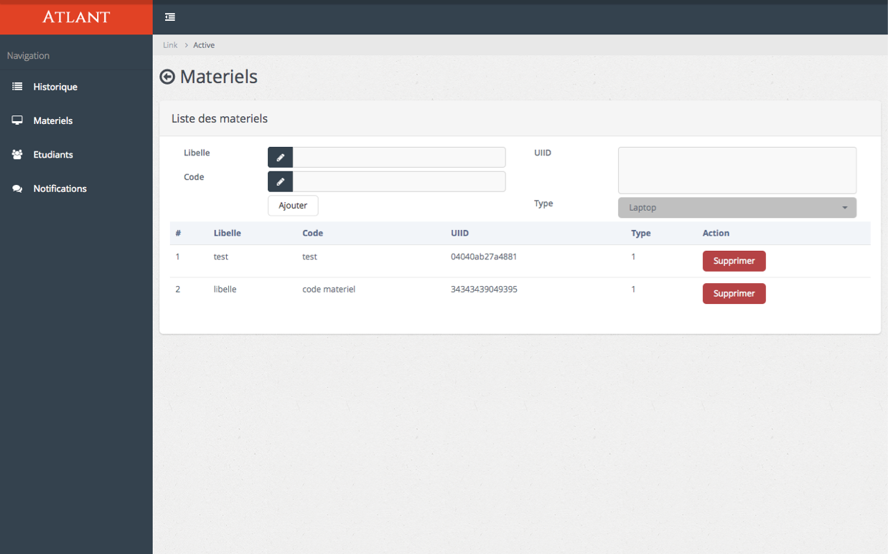
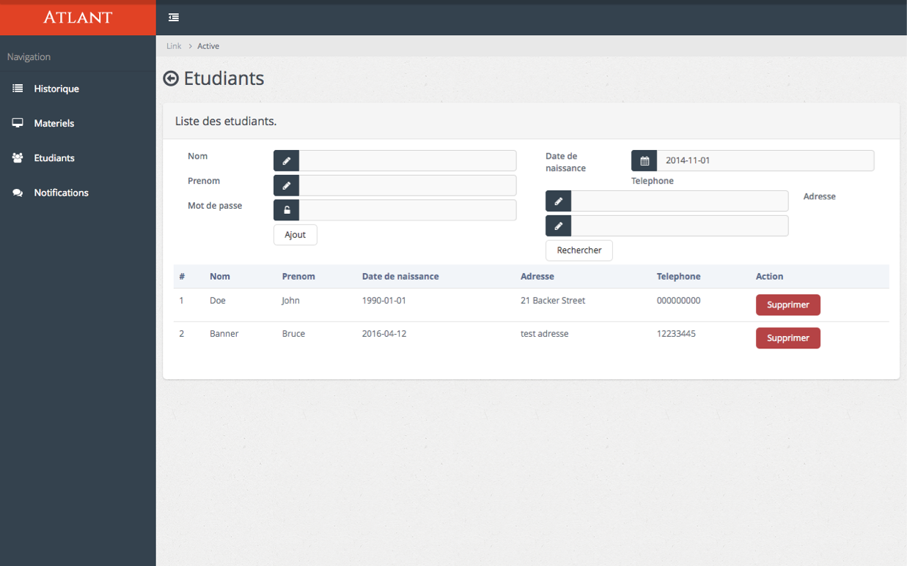

# README #

## INSTALLATION ##

### INSTALLATION DU SERVEUR ###

Les étapes à suivre pour la mise en marche du projet.

Tous les executables se trouve dans le dossier livrables. Il y a trois fichiers:

* script.sql
* GestionMaterielInfo.apk
* nfc.war

#### Prérequis ####
* Glassfish 4.1.1
* MySQL 

#### Base de données ####
* Dans MySQL il faut executer le fichier **script.sql**
* Puis créer un utilisateur nommé **root** *sans mot de passe*

#### Web Service ####
* Pour démarrer le serveur Glassfish 4.1.1, il faut aller dans le repertoire d'installation et executer la commande suivante.

$ bin/asadmin start-domain domain1  	
* Puis pour deployer le fichier **nfc.war** dans Glassfish, il faut executer la commande suivante:

$ bin/asadmin deploy /Users/macbook/Desktop/nfc.war

Maintenant l'application est disponnible sur [http://localhost:8080/nfc/rest/admin/historique/] (http://localhost:8080/nfc/rest/admin/historique/)

La base de données est initialisée lors de la première lancement.

### INSTALLATION DE L'APPLICATION ANDROID ###
Pour cela il suffit de copier l'apk sur l'appareil et de l'installer.

Lorsque l'application est installée **il faut preciser l'url ou l'adresse ip du serveur**. Pour cela il faut aller dans **Parametre**. Pour afficher l'écran des paramètres il faut cliquer sur l'icône  qu'on peut voir sur l'image ci-dessous.

Puis lorsqu'on est dans **Paramètre** il faut cliquer sur **URL Web Service** et changer la valeur avec l'adresse IP du serveur.

Maintenant l'application peut désormais se connecter avec le serveur.

## MODE D'EMPLOI ##
### ANDROID ###
#### SPLASH SCREEN ####

#### ACCUEIL ####

C'est dans cet écran qu'on scan le tag sur le materiel en cliquant sur le bouton **SCAN TAG**. Cela à pour effet d'enregistrer l'emprunt ou la remise du materiel.

#### HISTORIQUE ####
L'historique permet de lister tous les emprunts faits par l'étudiant.

#### PARAMETRES ####
L'écran des paramètres permet de renseigner le nom, le prénom, l'id ou matricule et enfin le mot de passe de l'étudiant.
L'url du web service est aussi renseigné ici.

**Il faut preciser tous les champs avec les informations contenues dans la base de données**

#### MENU ####
Le menu permet de choisir l'écran à afficher. 
Ici il y en 2:

- Accueil
- Historique

### INTERFACE ADMINISTRATEUR (WEB) ###
L'interface Administrateur comporte 3 menus.

#### HISTORIQUES ####
L'historique liste tous les emprunts faits par tous étudiants. 
Ici on peut filtrer les mouvements des matériels:

* Soit tout afficher, c'est-à-dire les matériels empruntés ainsi que les matériels rendus.
* Soit afficher seulement les matériels empruntés.
* Soit afficher seulement les matériels rendus.

L'admin peut aussi envoyer un notification de retard pour les étudiants qui n'ont pas encore rendus les matériels qu'ils ont emprunté.

#### MATERIELS ####
Cette page sert à gérer les matériels.
L'administrateur peut ajouter ou supprimer des matériels avec cette l'interface.

#### ETUDIANTS ####
Cette page sert à gérer les étudiants.
L'administrateur peut ajouter ou supprimer des étudiants avec cette l'interface.

